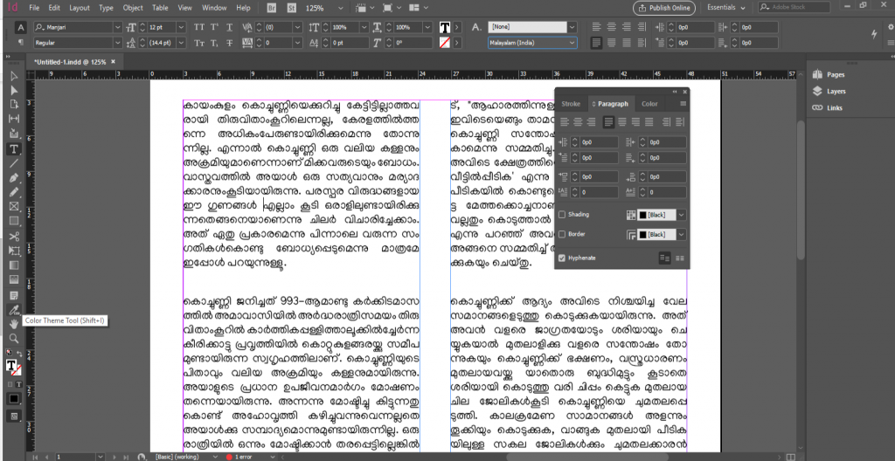

# Morphology analyser based approach

To check if a word is valid, known, correctly spelled word, a simple look up using morphology analyser is enough. If the morphology analyser can parse the word, it is correctly spelled. Note that the word can be an agglutinated at arbitrary levels and inflected at same time.

To provide spelling suggestions, [the FST based morphology analyser](../morphology-analysis.md) can be used. This is a three step process

1. Generate a list of candidate words from the query word. The words in this list may be incorrect too. The words are generated based on the patterns we defined based on the nature of spelling mistakes. We scan the query word for common patterns of errors and apply fix for that pattern. Since there dozens of patterns, we will have many candidate words.
2. From the candidate list, find out the correctly spelled word using spellcheck method. This will result a very small number of words. These words are the probable replacements for the misspelled query word.
3. Sort the candidate words to provide more probable suggestion as the first one. For this, we can do a ranking on the suggestion strategies. A very common error pattern get high priority at step 1. So the suggestions from that appear first in the candidate list. A more sophisticated approach would use a frequency model for the words. So candidate words that are very frequent in the language will appear as first candidate.

One thing I observed from the above approach is, in reality the candidate words after all the above steps for Malayalam is most of the time one or two. This make step 3 less relevant. At the same time, an edit distance based approach would have generated more than 5 candidate words for each misspelled word. The candidates from the edit distance based suggestion mechanism would be very diverse, meaning, they won’t have be related to the indented word at all.  The following images illustrates the difference.

#### Out of lexicon words 

Compared to the finite set word list, the FST based morphology analyser and generator system covers large number of words using its generation system based on morpho-phonotactics. For a discussion on this see my previous [blog post about the coverage test.](https://thottingal.in/blog/2018/08/11/malayalam-morphology-analyser-status-update/) Since every language vocabulary is a dynamic system, it is still impossible to cover 100% words in a language all the time. New words get added to language every now and then. There are nouns related to places, people names, product names etc that is not in the lexicon of Morphology analyser. So, these words will be reported as unknown words by the spellchecker. Unknown word is interpreted as misspelled word too. This issue is a known problem. But since a spellchecker is often used by a human user, the severity of the issue depends whether the spellchecker does not know about lot of commonly used words or not. Most of the spellcheckers provide an option to add to dictionary to avoid this issue.

As part of the Morphology analyser, the expansion of the lexicon is a never ending task. As the lexicon grows, the spellchecker improves automatically.




_Finite-State Spell-Checking with Weighted Language and Error_ _Models—Building and Evaluating Spell-Checkers with Wikipedia as Corpus_ Tommi A Pirinen, Krister Lindén \[[pdf](http://www.ling.helsinki.fi/~klinden/pubs/PirinenLrec2010.pdf)\] This paper outlines the usage of Finite state transducer technique to address the issue of infinite dictionary of morphologically rich languages. They use Finnish as the example language


